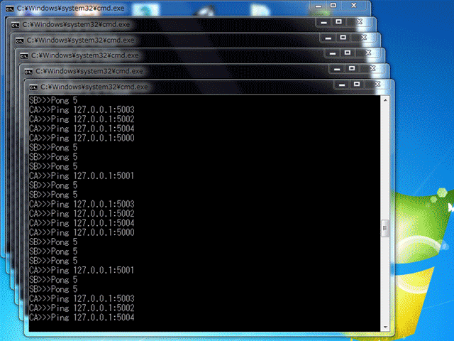

# omodokBlockchainとは  
オモドックPythonスクールの延長講座である「ブロックチェーン15回講座」で練習する教育用スクリプトの完成品です。  

# Demo: デモ画面

# Overview: 概要  
このスクリプトは教育目的に作られたため、ソースコードは初心者向けに書かれており、実際のブロックチェーンプログラムと比べると安全性が低く、規模が小さく、多くの重要な機能が欠けているため、実際のビジネスやプロダクションには使用しないでください。あくまでもブロックチェーンの学習用にご利用ください。  

# Description: 説明
なるべく本家の「Bitcoin」と同じ内容を学ぶようにしました。
1. Omodok Blockchain API  
	1-1. ブロックのハッシュ化はBitcoinと同じ「SHA-256セキュアハッシュ」を使用します  
	1-2. ブロックのマイニングはBitcoinと同じ「PoW（proof-of-work）」を採用しました。  
	1-3. 秘密鍵はBitcoinと同じ「256ビット」で作成します。  
	1-4. 公開鍵はBitcoinと同じ「ECDSA公開鍵暗号化方式」で作成します。  
	1-5. 残高管理は「genesis」ブロックから計算する「UTXO」型を採用しました。
	1-6. トランザクション作成時の「UTXO」の移動には「P2PKH」方式を採用しました。
2. Omodok Blockchain P2P Network  
	2-1. ソケット通信にはBitcoinと同じ「WebSocket」を使用しました。  
	2-2. 初回ハンドシェイク時にBitcoinと同じ「version、verack」交換を行いました。  
	2-3. 新規ノードの「ブロードキャスト送信」にBitcoinと同じ「addr」を使用しました。  
	2-3. ブロック高調整にBitcoinと同じ「getBlocks、inv、getData、block」を使用しました。  
	2-4. 自然なフォークの解決と「orphan（孤児）」ブロック対策を行いました。  
	2-5. 新規トランザクションの「ブロードキャスト通信」に「tx」を使用しました。  

# Dependency: 依存関係
windows版Python 3.5以上のAnacondaを「Add Anaconda to my PATH environment variable」をチェックしてインストールしてください。  
フォルダ内「setup.bat」をWクリックで依存モジュールをインストールしてください。  
Mac or Linuxでは動作確認していませんが、「.bat」を「.sh」に変え、1行目に「#!/bin/sh」を追加し、「chmod 755 ファイルのパス」とすれば動くと思われます。  

追加インストールされる依存モジュールは下記です。
* python -m pip install --upgrade pip
* pip install Setuptools
* pip install ecdsa
* pip install base58
* pip install flask
* pip install flask-cors
* pip install gevent-websocket
* pip install Flask-Sockets
* pip install websocket-client

# Start: 起動方法
1. [omodokBlockchain/port5000.bat]DNSシードノードをWクリックで開く。  
2. [omodokBlockchain/port5001/port5001.bat]通常ノードをWクリックで開く。  
3. [omodokBlockchain/port5002/port5002.bat]通常ノードをWクリックで開く。  
4. [omodokBlockchain/port5003/port5003.bat]通常ノードをWクリックで開く。  
5. [omodokBlockchain/port5004/port5004.bat]通常ノードをWクリックで開く。  
6. [omodokBlockchain/port5005/port5005.bat]通常ノードをWクリックで開く。  

# Check: 動作確認
1. [port5000〜port5005]までの6個のコマンドプロンプトの起動を確認する  
2. [omodokBlockchain/index.html]をWクリックで開く。
3. [127.0.0.1:5000/index2〜5005/index2]のリンクから各HPの「採掘」を1回ずつクリックする。
4. [127.0.0.1:5000/index2〜5005/index2]の各HPの「Block列6」でブロックの伝播を確認する。
5. [index.html→127.0.0.1:5000→ウォレットを取得する→Addressをコピー]。  
6. [index.html→127.0.0.1：5001→取引をする→Recipient Address:欄にペースト]。  
7. [トランザクションの作成→トランザクションの確認→成功した取引！をOK]する。 
8. [127.0.0.1:5000/index2〜5005/index2]のリンクから各HP上部の「Tx」の伝播を確認する。  
9. どこかのノードで「採掘」し、上部未承認Txのクリアと、下部ブロックへの追加を確認する。  

# MIT LICENCE: MITライセンス
1. このソフトウェアを誰でも無償で無制限に扱って良い「MITライセンス」です。ただし、著作権表示および本許諾表示をソフトウェアのすべての複製または重要な部分に記載しなければならない。  
2. 作者または著作権者は、ソフトウェアに関してなんら責任を負わない。  
3. Copyright (c) 2018 Omodok School  

* 今回Pythonプログラム部分はすべてオリジナルで作成しましたが、「Omodok Blockchain API」で使用するhtmlファイルは同じくMIT LICENCEとなっている  
https://github.com/adilmoujahid/blockchain-python-tutorial  
内のhtmlファイルを使用させてもらいました。このHP部分のコピーライトは下記になります。  
Original Work Copyright (c) 2017 Daniel van Flymen  
Modified work Copyright (c) 2018 Adil Moujahid  
改めてお礼申し上げます。  

# Lessen: レッスン
ブロックチェーンの仕組みを学ぶもっとも早い方法は、実際にプログラムソースを書いてみることです。これらソースファイルの内容について深く学ばれたい方向けに、オモドックスクールでは「初心者向けPython25回講座」と「ブロックチェーン15回講座」を割引セットにした「Pythonブロックチェーン40回セットコース」を用意しております。興味のある方はhttp://www.omodok.co.jp/it/python.html  
をご覧ください。  

# Web Site：
http://www.omodok.co.jp/it/python.html